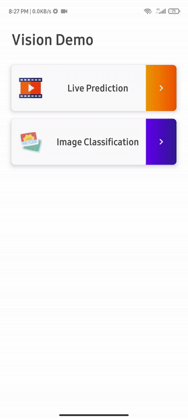
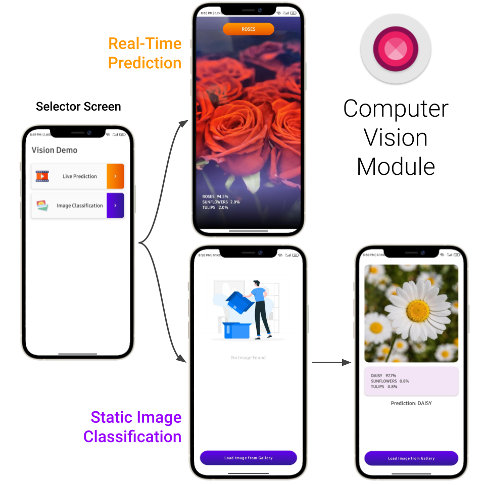

<h1 align="center">Android Machine Learning App Template</h1>

Perform Native Machine Learning in Android App using Tensorflow Lite

 
 
 

&nbsp &nbsp &nbsp &nbsp &nbsp &nbsp &nbsp

 
 
 
<h2 align="center">Computer Vision Module</h2>

